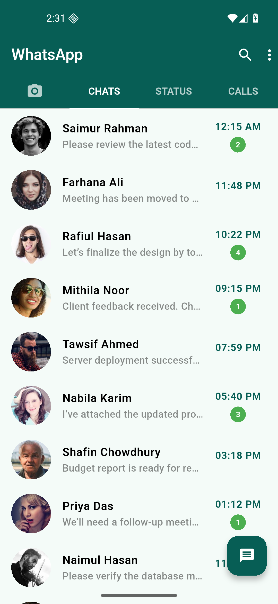
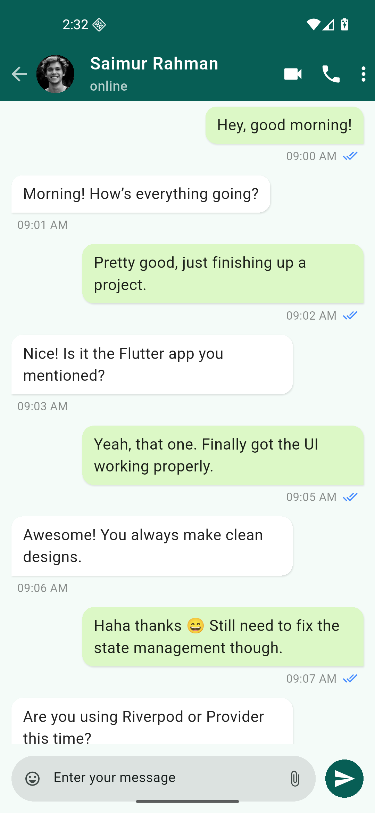
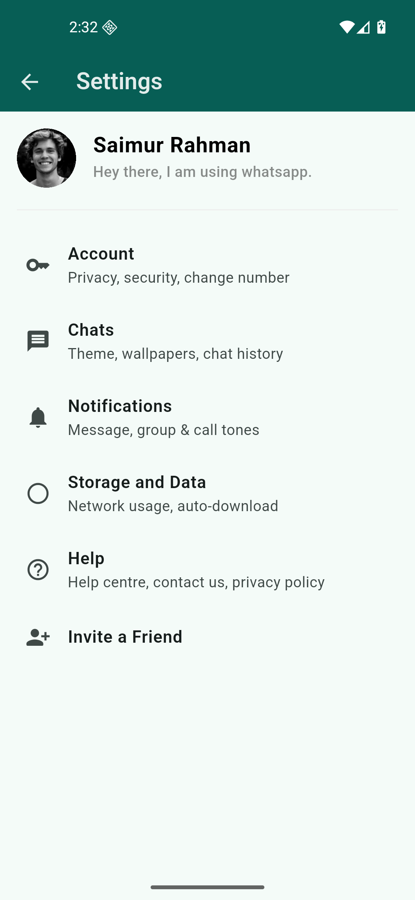

# WhatsApp Clone UI

A Flutter-based WhatsApp UI clone built for learning and practice purposes.

## Overview

This project is a **demo application** that replicates the core user interface of WhatsApp. It includes features like chat screens, status tabs, call logs, and settings—purely for **educational and practice purposes**.

> **Note:** This is a UI-only implementation. No backend, authentication, or real messaging functionality is included.

## Features

-   📱 **Home Screen** with tabbed navigation (Chats, Status, Calls)
-   💬 **Chat List** with profile images, message previews, and timestamps
-   🗨️ **Message View** with WhatsApp-style chat bubbles
-   ⚙️ **Settings Screen** with profile and account options
-   🎨 **WhatsApp Color Scheme** (green theme, white/light green bubbles)
-   🚀 **Splash Screen** with smooth navigation

## Screenshots

<p align="center">
  
  
  
</p>

## Getting Started

### Prerequisites

-   Flutter SDK (3.0 or higher recommended)
-   Dart 3.0+
-   An IDE (VS Code, Android Studio, etc.)

### Installation

1. Clone the repository:

    ```bash
    git clone https://github.com/yourusername/whatsapp_clone.git
    cd whatsapp_clone
    ```

2. Install dependencies:

    ```bash
    flutter pub get
    ```

3. Run the app:
    ```bash
    flutter run
    ```

## Project Structure

```
lib/
├── views/
│   ├── splash.dart          # Splash screen
│   ├── home_view.dart       # Main tabbed interface
│   ├── message_view.dart    # Chat conversation screen
│   └── settingsview.dart    # Settings/profile screen
└── main.dart                # App entry point
```

## Learning Goals

This project demonstrates:

-   Flutter widget composition
-   Navigation (Navigator.push, pushReplacement)
-   TabBar and TabBarView
-   ListView.builder for dynamic lists
-   Custom chat bubble UI
-   State management basics
-   Material Design patterns

## Disclaimer

This is a **practice project** created for learning Flutter UI development. It is **not affiliated with WhatsApp** or Meta Platforms, Inc. All design inspiration is for educational purposes only.

## Resources

-   [Flutter Documentation](https://docs.flutter.dev/)
-   [Material Design Guidelines](https://m3.material.io/)
-   [Dart Language Tour](https://dart.dev/guides/language/language-tour)

## License

This project is open-source and available under the MIT License.
